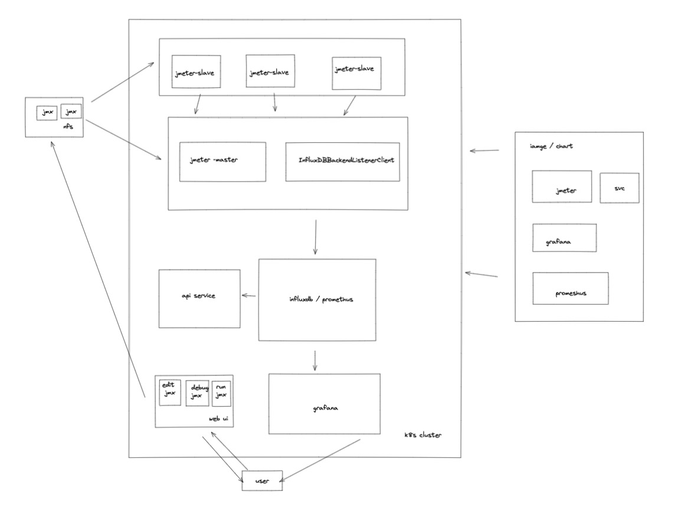

# kakax

Distributed performance testing platform based on K8s

## architecture



## required

- [docker](https://hub.docker.com/editions/community/docker-ce-desktop-mac)
- cluster（[kind](https://kind.sigs.k8s.io/docs/user/quick-start/#installation)）
- [kubectl](https://www.kubernetes.org.cn/installkubectl)

## install

```bash
cd kakax
sh install.sh
```

## quick start

### test in cluster mode

```bash
# get jmeter-master pod
k get  pod | grep jmeter-master

# exec pod
kubectl exec -it jmeter-master-84db88ff8f-vw4h7 -- bash

# run test
/apache-jmeter-5.4.3/bin/jmeter.sh -n -t pef-test.jmx -l log.jtl -R  jmeter-slave-0.jmeter-slave.default.svc.cluster.local:1099
```

### scale slave pod

```bash
kubectl scale --replicas=4 StatefulSet/jmeter-slave
```

### dashboard

```bash
# grafana service port forward
kubectl port-forward svc/grafana 8080:3000

# get user/password 
echo "User: admin"
echo "Password: $(kubectl get secret grafana-admin --namespace default -o jsonpath="{.data.GF_SECURITY_ADMIN_PASSWORD}" | base64 --decode)"

# open url
open http://127.0.0.1:8080
```

## todo

- api service
- web ui
- nfs
